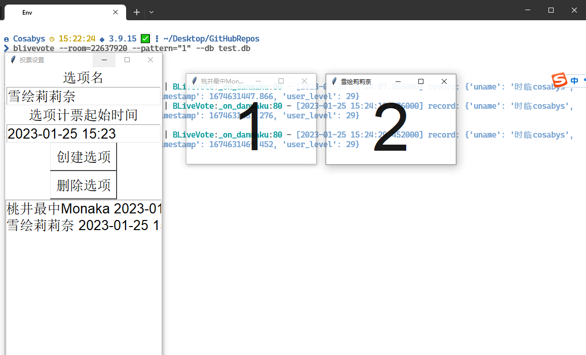

## BLiveVote

基于blivedm的直播间投票器客户端。

### 使用方法

0. `git submodule update --init --recursive`初始化`blivedm`子模块

1. 通过pip+git安装该Python包: `pip install git+https://github.com/thautwarm/BLiveVote.git`

2. `blivevote --room=22637920 --pattern="投票关键词" --db 数据存储地址`

3. 在打开的UI中，编辑投票选项和投票起始时间，每一个投票选项会自动启动一个透明窗口（方便OBS捕捉），显示对应选项的票数。

